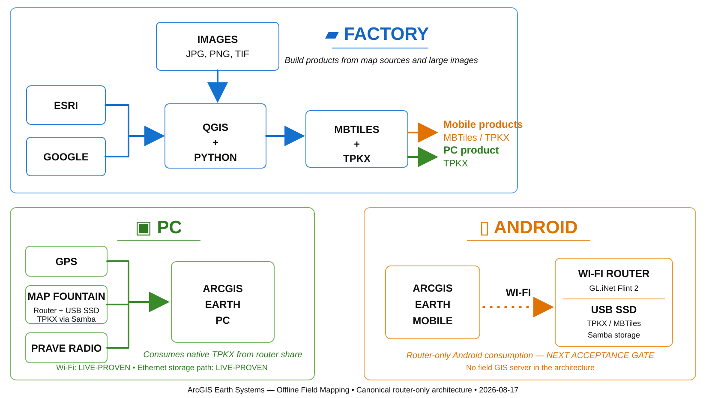

# Map Fountain

## Proven router-attached map storage — now parked from the primary personal-phone path

**Map Fountain proved that a consumer router plus USB SSD can act as a useful private offline map reservoir without becoming a GIS server.**



> **The router does not need to understand maps. It only needs to return the right bytes.**

---

## Current project status — 2026-08-18

**PROVEN / PARKED.**

Map Fountain achieved its fundamental engineering goals:

- Windows ArcGIS Earth opened a production-scale native TPKX directly from router-attached SSD storage over SMB/Wi-Fi.
- ArcGIS Earth Mobile rendered a Static REST WMTS map directly from the same router/SSD class of architecture over local HTTPS/Wi-Fi.

Those are successful proof results.

The broader project has since simplified the normal personal-phone deployment path further:

```text
TPKX
→ microSD card
→ Android
→ ArcGIS Field Maps / ArcGIS Earth
```

That direct local-storage path is now being developed in:

**[Android Field Maps + ArcGIS Earth](https://github.com/Jim-dc95811/Android-Field-Maps-and-ArcGIS-Earth-)**

Map Fountain therefore remains a **live-proven engineering reference**, not required infrastructure for every phone.

---

## Live milestone — Windows ArcGIS Earth

```text
native TPKX on USB SSD
        ↓
GL.iNet Flint 2 (GL-MT6000)
        ↓
Samba / SMB
        ↓
private Ethernet or Wi-Fi
        ↓
Windows
        ↓
ArcGIS Earth
```

A production-scale `ESG1N.tpkx` package was opened **in place** from the router-attached SSD and rendered interactively in ArcGIS Earth over Wi-Fi.

Accepted specimen identity:

- `ESG1N.tpkx`
- script-observed size: **26,174,899,216 bytes**
- Windows File Explorer identification: **25,561,426 KB**
- network path: `\\192.168.8.1\New TPKX\Esri and Label\ESG1N.tpkx`

### Benchmark baseline

Ethernet:

- random seek: **25.33 MiB/s**
- random p95: **9.98 ms**
- four-client aggregate: **51.21 MiB/s**
- sequential: **42.58 MiB/s**

Wi-Fi:

- random seek: **5.19 MiB/s**
- random p95: **50.56 ms**
- four-client aggregate: **5.31 MiB/s**
- sequential: **6.14 MiB/s**

The decisive result was not the synthetic benchmark. **ArcGIS Earth itself opened and navigated the native TPKX while it remained on the router-attached SSD.**

---

## Live milestone — ArcGIS Earth Mobile / Android

Accepted mobile flavor:

> **Static REST WMTS**

```text
pre-rendered Static REST WMTS folder
        ↓
USB SSD
        ↓
GL.iNet Flint 2
        ↓
built-in local HTTPS/WebDAV file endpoint
        ↓
private Wi-Fi
        ↓
Android
        ↓
ArcGIS Earth Mobile
```

ArcGIS Earth Mobile accepted the router-hosted `WMTSCapabilities.xml`, requested static raster tiles, and rendered the test map. The app cache was then cleared, ArcGIS Earth was force-stopped/reopened, and the same router-hosted map loaded again.

No Python runtime, helper app, QGIS Server, Windows map server, Raspberry Pi, or active GIS server was required on the accepted Android router path.

Operational observation: deliberate pan/zoom worked; rapid gestures could stall or behave erratically.

Full acceptance record:

- [Static REST WMTS Android acceptance — 2026-08-17](docs/STATIC_REST_WMTS_ANDROID_ACCEPTANCE_2026-08-17.md)

---

## What Map Fountain proved

The important architectural lesson is broader than one router model:

```text
map intelligence can stay in the map product / viewer
storage can stay dumb
networking can stay ordinary
```

For Windows, native TPKX remained compact and was selectively read over SMB.

For Android, the serverless Static REST WMTS experiment proved that ordinary static files could satisfy ArcGIS Earth Mobile when the compatibility product was manufactured ahead of time.

Both results remain useful engineering evidence even though the normal personal-phone deployment is moving to direct removable storage.

---

## Why the project is parked

The target field users often use personal phones and do not want extra infrastructure.

Once a large native map can live on a microSD card, the normal phone workflow becomes simpler:

```text
prepared card
→ phone
→ local map
```

No router association, no HTTPS endpoint, no QR service URL, no shared SSD, and no server-shaped operational concept are required for the basic user.

That simplicity wins unless a different field problem proves shared storage is needed.

---

## Possible future return — Starlink / basecamp NAS

Map Fountain may come back in a different role:

```text
Starlink
        ↓
Flint 2 WAN
        ↓
USB SSD
        ↓
private SMB / Wi-Fi / Ethernet
        ↓
basecamp laptops / local clients
```

In that role it becomes a **poor-man's NAS / incident map reservoir**:

- shared local map inventory;
- easy laptop access;
- fresh Factory products can be dropped onto the SSD;
- Starlink can support imagery refresh/manufacturing when available;
- loss of Starlink does not destroy the local LAN or stored maps.

This is a future reopening path, not a current requirement.

---

## Static REST manufacturing experiments

The Android router proof triggered several Factory experiments around large Static REST WMTS deployments.

The production-scale lesson was harsh: hundreds of thousands of loose files are expensive to expand, package, copy, reread, and delete.

A later `TPKX_MAP_FACTORY_v1_4_0_TEST` experiment moved toward a compact portable `.restmap` seed that expands the runtime WMTS tree only at the final SSD location.

That lifecycle fixture is self-tested, but REST manufacturing is no longer the primary personal-phone priority. Preserve the work as engineering history unless Map Fountain is reopened for a real use case.

---

## Historical Windows WMTS precursor

On 2026-08-16, before the router-only proof, a Windows-hosted implementation proved:

```text
raster MBTiles
→ local HTTPS WMTS server
→ Android USB tether
→ ArcGIS Earth Mobile
```

That work proved local/offline mobile tile consumption, HTTPS, QR loading, per-map service identity, multiple substantial MBTiles, and operation with outside Internet removed.

It is important lineage, not the current runtime architecture.

---

## Current status matrix

| Capability | Status |
| --- | --- |
| Flint 2 + USB SSD Samba share | ✅ **LIVE-PROVEN** |
| Large TPKX open/stat over Samba | ✅ **LIVE-PROVEN** |
| Large-file Ethernet benchmark | ✅ **LIVE-PROVEN** |
| Large-file Wi-Fi benchmark | ✅ **LIVE-PROVEN** |
| Windows ArcGIS Earth direct network TPKX over Wi-Fi | ✅ **LIVE-PROVEN** |
| Android direct file GET through Flint HTTPS/WebDAV | ✅ **LIVE-PROVEN** |
| ArcGIS Earth Mobile Static REST WMTS from router SSD | ✅ **LIVE-PROVEN** |
| Android cache-clear/reopen retest | ✅ **LIVE-PROVEN** |
| Primary personal-phone deployment role | ⏸️ **PARKED** |
| Possible Starlink/basecamp NAS role | 🟡 **FUTURE / NOT YET REOPENED** |
| Operational public-Internet dependency | **NONE BY DESIGN** |

---

## Evidence fingerprints — Windows acceptance

```text
Ethernet benchmark screenshot
710e19a0676ada1729a35e13693b8ae81d0527fc3ba654a2da32288ac58244af

Ethernet PCAP
3eda0dc91dee83ac12a96912d8f7264e846c7393c3983de34970b5571a622f0f

Wi-Fi benchmark screenshot
631af7d06f433964175e1c3dc414767cc4c08f98af006406d8068be3b081ba3f

Wi-Fi PCAP
67db0a4dfee9519f933f0fc2e550da69634b293c815cd4b2d81413b38c60f1d4

ArcGIS Earth Wi-Fi success screenshot
8592abb26f9025baf665e4c4174670ba3a2bb433db96cbd092dd27355a9fd840
```

The packet captures are large bench artifacts and are not committed here. These hashes identify the preserved originals used for the Windows acceptance record.

---

## Engineering record

- [Router acceptance record — 2026-08-17](docs/MAP_FOUNTAIN_ROUTER_ACCEPTANCE_2026-08-17.md)
- [Static REST WMTS Android acceptance — 2026-08-17](docs/STATIC_REST_WMTS_ANDROID_ACCEPTANCE_2026-08-17.md)
- [Acceptance record](docs/ACCEPTANCE_RECORD.md)
- [Technical architecture](docs/TECHNICAL_ARCHITECTURE.md)
- [AI / maintainer restart note](docs/AI_CONTINUITY_RESTART_NOTE.md)
- [Roadmap](ROADMAP.md)
- [Changelog](CHANGELOG.md)

---

## Project relationship

- **[Offline GeoStack](https://github.com/Jim-dc95811/Offline-GeoStack)** — master map manufacturing / field-mapping system.
- **[Rasta Pyramid Factory](https://github.com/Jim-dc95811/Rasta-Pyramid-Factory)** — high-resolution raster-pyramid manufacturing.
- **[Android Field Maps + ArcGIS Earth](https://github.com/Jim-dc95811/Android-Field-Maps-and-ArcGIS-Earth-)** — current personal-phone / microSD deployment work.
- **Map Fountain** — proven router/storage delivery evidence and possible future shared-storage appliance.

Original project software and documentation are MIT-licensed unless otherwise stated. Third-party imagery, ArcGIS Earth, QGIS, router firmware, and source data remain governed by their own licenses and terms.

---

# Map Fountain

> **It worked. We learned from it. Now we use it only when shared storage is actually the right tool.**
