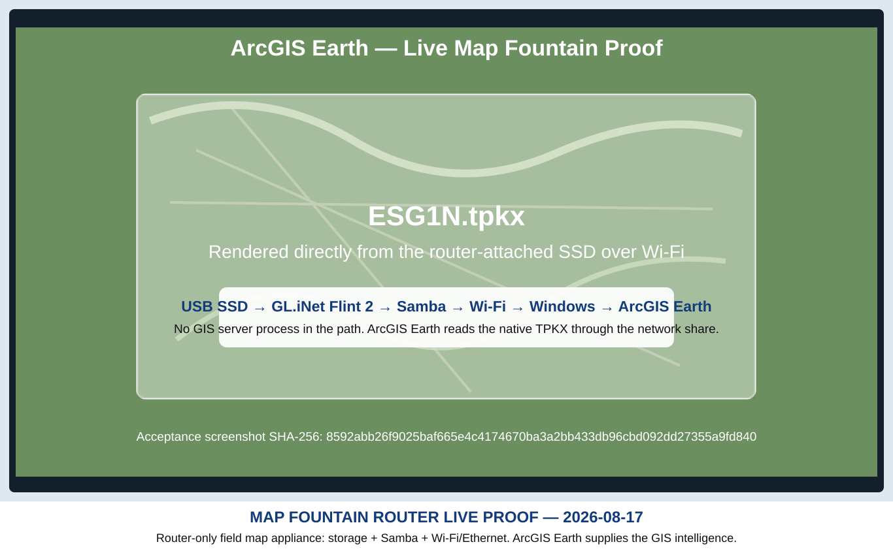

# Map Fountain

## Router-only offline map delivery for ArcGIS Earth

**A USB SSD on a consumer router becomes a private offline map reservoir. ArcGIS Earth reads native TPKX directly through the router's Samba share over Ethernet or Wi-Fi. No GIS server process is required in the field path.**


> **The router does not need to understand maps. It only needs to share bytes reliably. ArcGIS Earth supplies the GIS intelligence.**

---

## Live milestone — 2026-08-17

**Status: LIVE-PROVEN**

The tested field chain is:

```text
native TPKX on USB SSD
        ↓
GL.iNet Flint 2 (GL-MT6000)
        ↓
Samba / SMB network share
        ↓
Ethernet or Wi-Fi
        ↓
Windows laptop
        ↓
ArcGIS Earth
```

A production-scale `ESG1N.tpkx` package was opened **in place** from the router-attached SSD and rendered interactively in ArcGIS Earth over Wi-Fi.



The package used for the large-file tests was:

- `ESG1N.tpkx`
- script-observed size: **26,174,899,216 bytes**
- Windows File Explorer identification: **25,561,426 KB**
- router share: `\\192.168.8.1\New TPKX\Esri and Label\ESG1N.tpkx`

The final acceptance authority was the real viewer: **ArcGIS Earth rendered and navigated the network-hosted TPKX over Wi-Fi.**

---

## Controlled storage proof

The Map Tank First Bench v0.1.1 TEST deliberately tested random access before sequential access so Windows cache/read-ahead would not contaminate the most important measurement.

### Ethernet — PASS

- random-seek: **25.33 MiB/s**
- random average latency: **9.34 ms**
- random median: **9.42 ms**
- random p95: **9.98 ms**
- random max: **16.17 ms**
- four-client aggregate: **51.21 MiB/s**
- sequential sample: **42.58 MiB/s**

### Wi-Fi — PASS

- random-seek: **5.19 MiB/s**
- random average latency: **46.36 ms**
- random median: **45.42 ms**
- random p95: **50.56 ms**
- random max: **66.71 ms**
- four-client aggregate: **5.31 MiB/s**
- sequential sample: **6.14 MiB/s**

The Wi-Fi test was much slower than Ethernet but completed successfully. The long sequential phase was not a hang; the 536,870,912-byte sample completed in **83.440 seconds**.

Wireshark captures were retained and inspected. The Ethernet and Wi-Fi SMB paths remained stable at the TCP level during the captured tests; the Wi-Fi capture began shortly after the benchmark started, so the script remains the authority for the early random/four-client measurements in that run.

---

## Evidence fingerprints

These SHA-256 values identify the original local evidence used for the 2026-08-17 acceptance record:

```text
Ethernet benchmark screenshot
710e19a0676ada1729a35e13693b8ae81d0527fc3ba654a2da32288ac58244af

Ethernet PCAP
3eda0dc91dee83ac12a96912d8f7264e846c7393c3983de34970b5571a622f0f

Wi-Fi benchmark screenshot
631af7d06f433964175e1c3dc414767cc4c08f98af006406d8068be3b081ba3f

Wi-Fi PCAP
67db0a4dfee9519f933f0fc2e550da69634b293c815cd4b2d81413b38c60f1d4

ArcGIS Earth Wi-Fi success screenshot
8592abb26f9025baf665e4c4174670ba3a2bb433db96cbd092dd27355a9fd840
```

The packet captures themselves are intentionally not committed to this repository because they are large bench artifacts. The hashes make the acceptance record independently checkable against the preserved originals.

---

## Why this architecture matters

The field appliance is intentionally dumb:

```text
USB storage
+ local network
+ Samba file sharing
= Map Fountain
```

There is no requirement for a field GIS server, map-rendering service, Python process, SQLite tile server, cloud account, or public Internet connection for the proven Windows/TPKX path.

The design takes advantage of a useful division of labor:

- the **Factory** manufactures the map;
- the **SSD** stores the finished map;
- the **router** exposes the file over the local network;
- **Windows SMB** carries the file access;
- **ArcGIS Earth** understands and renders the TPKX.

Changing the map library does not require GIS-specific router configuration. Add finished maps to the SSD, replace maps, or swap in another prepared SSD.

---

## Feeder / Eater operating model

### Eaters

Field clients consume the Map Fountain read-only where practical.

Current proven Eater:

- Windows laptop running ArcGIS Earth and opening native TPKX directly from the router share.

Additional ArcGIS Earth clients can be tested without changing the router's job.

### Feeder

At basecamp, a future Feeder tool may:

```text
approved master map library
        ↓
find Map Fountain
        ↓
compare SSD inventory
        ↓
add / replace / retire maps
        ↓
verify
        ↓
MAP FOUNTAIN CURRENT
```

The router itself does not need Feeder/Eater logic.

---

## Relationship to the earlier Windows Map Fountain proof

On 2026-08-16 a separate Windows-hosted implementation proved:

```text
raster MBTiles
→ local HTTPS WMTS
→ Android USB tether
→ ArcGIS Earth Mobile
```

That work remains useful engineering history and proved ArcGIS Earth Mobile could consume locally delivered raster tiles with outside Internet removed.

The **current field-appliance direction is router-only**. The 2026-08-17 breakthrough removed the active GIS-server requirement from the proven desktop TPKX path.

---

## Current status

| Capability | Status |
| --- | --- |
| USB SSD exposed by Flint 2 Samba | ✅ **LIVE-PROVEN** |
| Large TPKX open/stat over Samba | ✅ **LIVE-PROVEN** |
| Large-file Ethernet random/sequential benchmark | ✅ **LIVE-PROVEN** |
| Large-file Wi-Fi random/sequential benchmark | ✅ **LIVE-PROVEN** |
| ArcGIS Earth direct network TPKX over Wi-Fi | ✅ **LIVE-PROVEN** |
| ArcGIS Earth direct network TPKX over Ethernet | 🟡 **NEXT COMPARISON GATE** |
| Multiple simultaneous ArcGIS Earth Eaters | 🟡 **NOT YET ACCEPTED** |
| Router-only ArcGIS Earth Mobile path | 🟡 **NOT YET ACCEPTED** |
| Operational public-Internet dependency | **NONE BY DESIGN** |

---

## Prior-art / novelty boundary

A 2026-08-17 search found established prior art for the individual ingredients: router-hosted Samba storage, GIS access to network shares, TPKX optimized for network-file access, NAS-based geospatial workflows, and active tile servers.

What was **not** found in that search was a published implementation of this exact proven chain:

```text
consumer router + USB SSD
→ Samba
→ Wi-Fi
→ ArcGIS Earth
→ large native TPKX opened and rendered in place
```

That is not presented as a mathematically proven worldwide first. It is recorded as an independently developed, measured architecture for which no matching published implementation was found during the documented prior-art search.

---

## Governing rules

- No operational dependence on public Internet.
- Keep the router dumb, local, and predictable.
- Use DHCP for normal consumers.
- Prefer read-only field consumption where practical.
- Change one major test variable at a time.
- Wireshark and real-viewer evidence outrank assumptions.
- Do not call a path proven until the intended ArcGIS Earth runtime passes it.
- Do not add field server complexity unless a real target proves it is necessary.

---

## Project relationship

- **[Offline GeoStack](https://github.com/Jim-dc95811/Offline-GeoStack)** — master operational field-mapping system.
- **[Rasta Pyramid Factory](https://github.com/Jim-dc95811/Rasta-Pyramid-Factory)** — high-resolution raster pyramid manufacturing.
- **Map Fountain** — router-attached offline map storage and local delivery.

Original project software and documentation are MIT-licensed unless otherwise stated. Third-party imagery, ArcGIS Earth, QGIS, router firmware, and source data remain governed by their own licenses and terms.

---

# Map Fountain

> **Put the maps on the SSD. Plug it into the router. Let ArcGIS Earth drink.**
