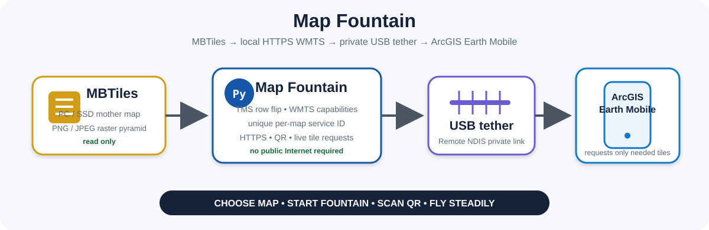

# Map Fountain Documentation



## Start here

- [Project status — 2026-08-16](PROJECT_STATUS_2026-08-16.md) — founding continuity checkpoint.
- [Acceptance record](ACCEPTANCE_RECORD.md) — what is actually live-proven.
- [Operator workflow](OPERATOR_WORKFLOW.md) — current Windows/Android procedure.
- [Technical architecture](TECHNICAL_ARCHITECTURE.md) — MBTiles, TMS/XYZ, WMTS, USB tether, HTTPS, QR, and cache-isolation mechanics.
- [HTTPS certificate note](HTTPS_CERTIFICATE_NOTE.md) — current fixed-IP bench limitation and security boundary.
- [AI / maintainer restart note](AI_CONTINUITY_RESTART_NOTE.md) — cold-start truth and do-not-regress rules.
- [GitHub metadata](GITHUB_METADATA.md) — recommended About description/topics for the one repository setting the connector cannot edit.
- [Release status](../releases/README.md) — why v0.2.1 is live-proven TEST rather than a finished public binary release.
- [Roadmap](../ROADMAP.md) — next productization gates.
- [Changelog](../CHANGELOG.md) — exact sequence from first 174-tile proof to v0.2.1.
- [Security](../SECURITY.md) — private-key and network-exposure guidance.

## Current shorthand

```text
MBTiles
→ Map Fountain
→ local HTTPS WMTS
→ private USB tether
→ ArcGIS Earth Mobile
```

## Evidence rule

> **Do not promote a capability merely because the server can theoretically do it. The real mobile viewer decides.**
