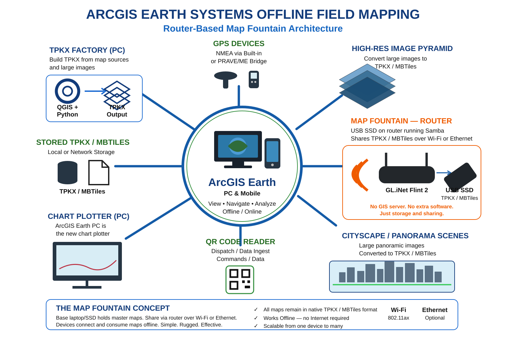

# Map Fountain Documentation



## Start here

- [Project status — 2026-08-17](PROJECT_STATUS_2026-08-17.md) — current router-only LIVE-PROVEN checkpoint.
- [Acceptance record](ACCEPTANCE_RECORD.md) — benchmark results, ArcGIS Earth proof, and evidence hashes.
- [Router acceptance record](MAP_TANK_TEST_PLAN_2026-08-17.md) — exact Ethernet/Wi-Fi test sequence and live results.
- [Technical architecture](TECHNICAL_ARCHITECTURE.md) — USB SSD, Flint 2, Samba/SMB, Windows, ArcGIS Earth, and benchmark boundaries.
- [AI / maintainer restart note](AI_CONTINUITY_RESTART_NOTE.md) — current cold-start truth and do-not-regress rules.
- [Roadmap](../ROADMAP.md) — next controlled acceptance gates.
- [Changelog](../CHANGELOG.md) — chronology from Windows-hosted WMTS experiments to the router-only proof.
- [Security](../SECURITY.md) — publication/network-exposure guidance.

Historical 2026-08-16 Windows-hosted WMTS documents remain in the repository as engineering lineage. They are not the current field architecture.

## Current shorthand

```text
native TPKX on USB SSD
→ GL.iNet Flint 2
→ Samba / SMB
→ Ethernet or Wi-Fi
→ ArcGIS Earth
```

## Evidence rule

> **The real ArcGIS Earth runtime decides acceptance. Keep the router dumb and the maps native.**
